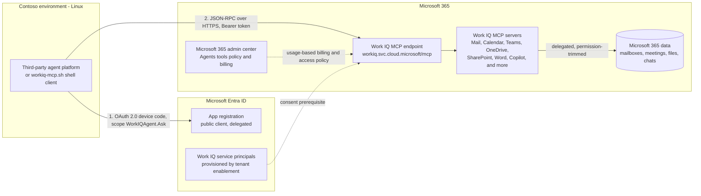

# Work IQ MCP: Third-Party Agent Integration Runbook

> **Note:** This is a validation runbook, not a production implementation. See [Scope and limitations](#scope-and-limitations).

**End-to-end validation runbook for integrating a third-party, Linux-hosted agent with Microsoft 365 organizational context through Work IQ MCP.**

This repository documents a tested integration pattern for connecting a custom or third-party agent to the Work IQ MCP endpoint. The validation was performed from a Linux client (WSL Ubuntu) using `curl`, `jq`, and standard OAuth 2.0 flows. The scripts in this repository are intended to validate the protocol, authentication, tenant configuration, billing, and Microsoft 365 data-access path. They are not intended to serve as a production agent implementation.

## Scenario

Contoso operates an existing third-party AI agent platform hosted in a Linux environment. The platform already integrates with enterprise systems such as Jira and Confluence. Contoso wants to extend the agent with Microsoft 365 organizational context, including email, Teams conversations and meetings, files, calendar information, and other user-accessible work data.

This runbook validates whether that architecture can use Work IQ MCP to securely access Microsoft 365 context on behalf of an authenticated user.

## Objective

Validate the integration pattern:

`Third-party Linux-hosted agent -> Work IQ MCP -> Microsoft 365`

The validation focuses on authentication, MCP connectivity, user-scoped Microsoft 365 access, Work IQ reasoning, tenant enablement, and usage-based billing.

## Purpose

A successful Work IQ MCP integration depends on multiple configuration layers, including Microsoft Entra ID authentication, tenant enablement, Microsoft 365 service access, tenant policy, and usage-based billing. Configuration issues across these layers can result in similar authorization or entitlement errors.

This runbook documents a repeatable validation sequence and troubleshooting guidance based on issues observed during testing.

## What gets validated

| Capability | Tool | Result |
|---|---|---|
| Delegated auth from Linux (device code flow) | `workiq-mcp.sh` | OAuth token issued for a custom Microsoft Entra app |
| MCP handshake + tool discovery | `tools` command | Server responds and exposes the Work IQ tool surface |
| Entity data access (mail, calendar, files) | `fetch` command | HTTP 200 with real mailbox data |
| Work IQ reasoning over Microsoft 365 content | `ask` command | Natural-language answers over mail/meetings/files |

## Architecture



Key properties of this architecture:

- **Protocol-based integration.** The remote Work IQ MCP endpoint uses standard MCP over HTTPS, allowing compatible agent platforms and MCP clients to integrate without requiring a Windows-hosted agent runtime.
- **User-scoped delegated access.** Work IQ uses Microsoft Entra delegated authentication. Requests execute in the context of the signed-in user and are limited by that user's existing Microsoft 365 permissions and applicable tenant policies. Application-only authentication is not supported.
- **Read-focused validation.** This runbook primarily validates grounding and read scenarios. Work IQ MCP also exposes write and action capabilities. Production use of those capabilities should be governed through appropriate tenant policies and limited to the requirements of the agent use case. See [Policy governance for Work IQ MCP](https://learn.microsoft.com/en-us/microsoft-365/copilot/extensibility/work-iq/mcp/policy-governance-mcp).
- **Consumption-gated.** Custom and third-party agents that use Work IQ are subject to usage-based billing (Copilot Credits). See the licensing and billing model below.

## Licensing and billing model

Work IQ API access is independent of Microsoft 365 Copilot licensing. There is no separate Work IQ API per-user license or SKU for custom applications. See the official [Work IQ overview](https://learn.microsoft.com/en-us/microsoft-365/copilot/extensibility/work-iq/) and [Work IQ API overview](https://learn.microsoft.com/en-us/microsoft-365/copilot/extensibility/work-iq/api-overview).

For custom and third-party agents, Work IQ API usage is consumption-based and measured using Copilot Credits. Before tool execution, the organization must configure the applicable Work IQ usage-based billing method and ensure that the users participating in the integration are included in the appropriate access and spending policy.

Users must also have access to the underlying Microsoft 365 workloads and content that the agent is expected to query. Work IQ respects the permissions of the authenticated user and does not grant access to Microsoft 365 content that the user could not otherwise access.

> **Important: Work IQ licensing**
>
> A Microsoft 365 Copilot license is **not required for direct Work IQ API access**. Custom and third-party agents use Work IQ through a **usage-based billing model based on Copilot Credits**.
>
> Users must be licensed and provisioned for the **underlying Microsoft 365 services they need to access**, such as Exchange Online, Teams, SharePoint, or OneDrive.
>
> Some Microsoft-hosted integration experiences (for example, the [Microsoft Foundry Work IQ quickstart](https://learn.microsoft.com/en-us/microsoft-365/copilot/extensibility/work-iq/mcp/quickstart/foundry)) list Microsoft 365 Copilot licensing as a prerequisite for those specific scenarios. Those requirements should not automatically be applied to a direct third-party Work IQ MCP integration; validate them separately when applicable.

## Required configuration layers

Every failed request during validation traced back to one of these layers. Check them in order:

| # | Layer | Requirement | Symptom when missing |
|---|---|---|---|
| 1 | **Identity** | Microsoft Entra app and delegated authentication; correct Entra directory roles for setup and Azure RBAC for billing configuration | `Insufficient privileges`, RBAC errors |
| 2 | **Tenant enablement** | Work IQ enabled/provisioned for the tenant, with administrative consent | Entitlement error despite billing |
| 3 | **Microsoft 365 access** | Authenticated user has access to the workloads and data being queried (Exchange Online, Teams, SharePoint, OneDrive) | Empty results or entitlement error |
| 4 | **Tenant policy** | Work IQ/MCP use permitted for the applicable users and tools | Policy-denied responses |
| 5 | **Billing** | Usage-based Work IQ billing (Copilot Credits) configured and user in scope | `The caller is not entitled to use this tool. Please check your billing policy and AI credit entitlement.` |

## Repository map

```
.
├── README.md                     <- you are here
├── docs/
│   ├── 01-prerequisites.md       <- send this to stakeholders BEFORE the working session
│   ├── 02-runbook.md             <- the step-by-step
│   ├── 03-troubleshooting.md     <- errors observed during validation, with evidence and fixes
│   ├── 04-validation-evidence.md <- terminal outputs captured during validation
│   └── images/                   <- screenshots referenced by the docs
└── scripts/
    ├── setup-workiq-app.sh       <- idempotent Microsoft Entra app registration (bash + az cli)
    └── workiq-mcp.sh             <- shell-script MCP client (curl + jq, device code auth)
```

## Quickstart (assuming prerequisites are done)

Complete [docs/01-prerequisites.md](docs/01-prerequisites.md) first; it is also the checklist to send stakeholders before a working session. This is the condensed path. Each numbered step below corresponds to a step in [docs/02-runbook.md](docs/02-runbook.md), which adds the expected outputs and a validation check per stage; if this is your first run, follow the runbook instead.

```bash
# 1. Clone this repo and Microsoft's Work IQ repo
git clone https://github.com/renatocamara/workiq-mcp-third-party-runbook
git clone https://github.com/microsoft/work-iq

# 2. One-time tenant enablement (PowerShell, Global Administrator)
cd work-iq
Install-Module Microsoft.Graph -Scope CurrentUser
./scripts/Enable-WorkIQToolsForTenant.ps1

# 3. Create the client app registration (bash, from Linux)
cd ../workiq-mcp-third-party-runbook/scripts
az login --use-device-code
./setup-workiq-app.sh
# copy the two exports it prints

# 4. Configure usage-based billing (portal, one time)
#    Microsoft 365 admin center > Copilot > Cost management > Get started
#    Full walkthrough: docs/02-runbook.md, Step 4

# 5. Test (sign in as a user provisioned for the Microsoft 365 workloads under test)
export TENANT_ID="..."   # from step 3
export CLIENT_ID="..."   # from step 3
./workiq-mcp.sh tools
./workiq-mcp.sh fetch "/me/messages"
./workiq-mcp.sh ask "Do I have any meetings today?"
```

If any step fails, go straight to [docs/03-troubleshooting.md](docs/03-troubleshooting.md). Your error is almost certainly there. To compare your outputs against a known-good run, see [docs/04-validation-evidence.md](docs/04-validation-evidence.md).

## Production auth considerations

The scripts in this repo use the **OAuth 2.0 device code flow** on purpose: it provides a lightweight way to obtain a delegated token from a plain terminal, which is exactly what a validation runbook needs. It is **not** the recommended pattern for a production agent platform.

For production, the agent platform should implement **Authorization Code flow with PKCE** in its own front-end: each user signs in once through the platform's UI, and the platform manages token acquisition and silent renewal for each authenticated user through a secure token cache, preferably via **MSAL**. Device Code remains appropriate only for headless/CLI scenarios where no browser can be embedded.

What stays constant between test and production: Work IQ requires **delegated user context**; application-only / client-credentials authentication is not supported. Depending on the application's architecture, that user context can be established through interactive delegated authentication or an appropriate **on-behalf-of (OBO)** flow, and every request is permission-trimmed to that user. The delegated authorization model validated here through the device code flow remains applicable when moving to a production authentication flow; production implementations should adopt the flow and token lifecycle strategy appropriate to the platform.

## Path to production

This runbook validates the **core integration model**: the endpoint, delegated auth, the tool surface, and the entitlement model. That core model remains applicable in production; production introduces additional engineering, security, governance, and operational requirements around it. If you are taking this from validation to a production agent platform, plan for the following layers (auth is covered in the previous section):

**MCP client hardening.** `workiq-mcp.sh` is a validation probe, not production code. A real agent platform should use its existing MCP client library and add what the probe deliberately omits: session re-establishment when `Mcp-Session-Id` expires, proper SSE stream handling, timeouts, retry with exponential backoff for throttling (429), and an error taxonomy that distinguishes policy-denied (403, do not retry), entitlement failures (do not retry blindly; use the entitlement troubleshooting path to identify tenant provisioning, service access, policy, or billing issues, and alert an administrator), and transient errors (retry). Token handling moves from a cache file to a secrets vault, ideally via MSAL rather than raw OAuth.

**Multi-user lifecycle.** In production every user authenticates individually. Tenant-wide admin consent (Runbook Step 2) already covers consent at scale, but design for token expiry and revocation mid-task: long-running agentic flows on delegated auth need a defined UX for "your session needs re-authentication", and Conditional Access / Continuous Access Evaluation can invalidate tokens at any moment. Keep a strict mapping between platform users and Microsoft Entra identities; an agent that mixes tokens across users is a security incident.

**Governance.** Apply Conditional Access policies to the app registration (MFA, device compliance), log every call for audit (who asked what, answered from which data), and treat the oversharing review as a blocking prerequisite rather than a recommendation: semantic search over Microsoft 365 turns every excessive permission into a natural-language-accessible answer. Decide write actions formally; a read-focused posture is easy in a pilot, and the first request to enable writes deserves a real review.

**Billing as an ongoing operation.** The small credit cap used during validation is a test guardrail. Production needs consumption forecasting (measure what a typical user session costs; nobody knows until it is measured), spending policies segmented by group, alerts before the cap (reaching an applicable spending limit can interrupt Work IQ API access for the users governed by that policy until it resets), and a named owner for the consumption bill. Usage-based billing creates a FinOps conversation that per-user licensing never did.

**Data freshness expectations.** As observed during validation ([Troubleshooting #10](docs/03-troubleshooting.md#10-empty-results-that-look-like-failures-but-are-not)), newly created content was available through `fetch` before it became discoverable through `ask`, consistent with asynchronous indexing; indexing latency can vary. Productize that: either surface the freshness caveat to users, or combine `ask` (reasoning) with `fetch` (deterministic, fresh data) under the hood.

**Service evolution.** Validated against server v1.0.165.0; tool names, counts, and admin surfaces can evolve. Track the changelog, pin expectations to observed behavior, and keep a direct Microsoft Graph fallback designed for business-critical paths.

**Setup as code.** The one-time manual setup here (enablement script, `setup-workiq-app.sh`) should become IaC (Terraform/Bicep for the app registration and permission grants) and a formal change request for tenant enablement, executed by the organization's identity team rather than an individual admin.

A useful way to frame this with stakeholders: this runbook validates what is settled; the list above is the engineering and governance work that remains, and none of it invalidates what was validated here.

## Scope and limitations

This repository validates the Work IQ MCP integration pattern from a Linux environment. It does not provide a production implementation of a specific third-party agent platform.

Production deployments should separately address authentication lifecycle management, secure credential and token handling, Conditional Access requirements, session management, observability, retry behavior, capacity and cost controls, tenant governance, and security review.

## Status and disclaimers

- Validated against `WorkIQ.MCP.Server` v1.0.165.0 (August 2026). Service behavior, tool surface, and admin center experiences can evolve; always confirm against current Microsoft documentation.
- Consumption billing applies to custom and third-party agent usage. Set spending limits before testing in any tenant you care about.
- This is a field-engineering artifact, not an official Microsoft product. Official docs: [Work IQ overview](https://learn.microsoft.com/en-us/microsoft-365/copilot/extensibility/work-iq/), [Work IQ MCP overview](https://learn.microsoft.com/en-us/microsoft-365/copilot/extensibility/work-iq/mcp/overview), and [microsoft/work-iq](https://github.com/microsoft/work-iq).
