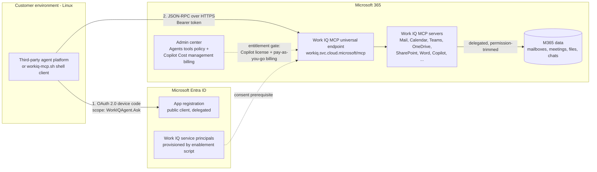

# Work IQ MCP: Third-Party Agent Integration Runbook

**Validated, end-to-end guide for connecting a third-party, Linux-hosted agent platform to Microsoft 365 data through the Work IQ MCP universal endpoint.**

This repository documents a complete, real-world validation of the Work IQ MCP integration path for custom and third-party agents. Everything here was tested from a Linux client (WSL Ubuntu) using nothing but `curl`, `jq`, and standard OAuth 2.0. No SDK, no Windows dependency, no Microsoft-hosted runtime.

> **Why this exists:** the happy path is simple, but there are four independent gates (identity roles, tenant enablement, licensing, and billing) that each produce confusing errors when missed. This runbook documents every gate, every error message we hit, and the exact fix, so you don't lose days rediscovering them.

## What gets validated

| Capability | Tool | Result |
|---|---|---|
| Delegated auth from Linux (device code flow) | `workiq-mcp.sh` | OAuth token issued for a custom Entra app |
| MCP handshake + tool discovery | `tools` command | Server responds, 11 tools listed |
| Entity data access (mail, calendar, files) | `fetch` command | HTTP 200 with real mailbox data |
| Copilot reasoning over M365 content | `ask` command | Natural-language answers over mail/meetings/files |

## Architecture



Key properties of this architecture:

- **Platform-agnostic.** The endpoint is plain HTTPS + JSON-RPC (MCP Streamable HTTP). Linux, containers, anything with an HTTP client works.
- **Delegated only.** Every call runs as a signed-in user. Application-only (client credentials) auth is not supported. The agent sees only what the user can see.
- **Read-only by default.** Write actions (send mail, create events) are disabled tenant-wide until an admin explicitly enables them.
- **Commercially gated.** Third-party agents are billed by consumption (Copilot Credits / pay-as-you-go), even when the user holds an M365 Copilot license. This is the gate most people miss. See [Troubleshooting #5](docs/03-troubleshooting.md#5-entitlement-error-persists-with-copilot-license-billing-gate).

## The four gates

Every failed request in our validation traced back to one of these. Check them in order:

| # | Gate | Symptom when missing | Fix |
|---|---|---|---|
| 1 | **Identity roles** (Entra role to set up; Azure RBAC for billing) | `Insufficient privileges`, RBAC errors | [Prerequisites](docs/01-prerequisites.md) |
| 2 | **Tenant enablement** (Work IQ service principals + consent) | Entitlement error even with license | `Enable-WorkIQToolsForTenant.ps1` from [microsoft/work-iq](https://github.com/microsoft/work-iq) |
| 3 | **Licensing** (M365 Copilot license on the user) | Entitlement error | Assign license in M365 admin center |
| 4 | **Billing** (pay-as-you-go spending policy for third-party agents) | `The caller is not entitled to use this tool. Please check your billing policy and AI credit entitlement.` | Copilot > Cost management > Get started |

## Repository map

```
.
├── README.md                     <- you are here
├── docs/
│   ├── 01-prerequisites.md       <- send this to stakeholders BEFORE the working session
│   ├── 02-runbook.md             <- the step-by-step
│   ├── 03-troubleshooting.md     <- every error we hit, with evidence and fixes
│   ├── 04-validation-evidence.md <- real terminal outputs proving each layer works
│   └── images/                   <- screenshots referenced by the docs
└── scripts/
    ├── setup-workiq-app.sh       <- idempotent Entra app registration (bash + az cli)
    └── workiq-mcp.sh             <- shell-script MCP client (curl + jq, device code auth)
```

## Quickstart (assuming prerequisites are done)

```bash
# 1. Clone this repo and Microsoft's Work IQ repo
git clone https://github.com/<your-org>/workiq-mcp-third-party-runbook
git clone https://github.com/microsoft/work-iq

# 2. One-time tenant enablement (PowerShell, Global Admin)
cd work-iq
Install-Module Microsoft.Graph -Scope CurrentUser
./scripts/Enable-WorkIQToolsForTenant.ps1

# 3. Create the client app registration (bash, from Linux)
cd ../workiq-mcp-third-party-runbook/scripts
az login --use-device-code
./setup-workiq-app.sh
# copy the two exports it prints

# 4. Activate pay-as-you-go billing (portal, one time)
#    M365 admin center > Copilot > Cost management > Get started
#    Full walkthrough: docs/02-runbook.md, Step 4

# 5. Test
export TENANT_ID="..."   # from step 3
export CLIENT_ID="..."   # from step 3
./workiq-mcp.sh tools
./workiq-mcp.sh fetch "/me/messages"
./workiq-mcp.sh ask "Do I have any meetings today?"
```

If any step fails, go straight to [docs/03-troubleshooting.md](docs/03-troubleshooting.md). Your error is almost certainly there. To compare your outputs against a known-good run, see [docs/04-validation-evidence.md](docs/04-validation-evidence.md).

## Production auth considerations

The scripts in this repo use the **OAuth 2.0 device code flow** on purpose: it is the cheapest way to obtain a delegated token from a plain terminal, which is exactly what a validation runbook needs. It is **not** the recommended pattern for a production agent platform.

For production, the agent platform should implement **Authorization Code flow with PKCE** in its own front-end: each user signs in once through the platform's UI, the platform stores a per-user **refresh token**, and access tokens are renewed silently in the background. Device Code remains appropriate only for headless/CLI scenarios where no browser can be embedded.

What does NOT change between test and production: Work IQ supports **delegated context only** (application-only / client-credentials auth is not supported), so a one-time interactive sign-in per user always exists regardless of flow, and every request is permission-trimmed to that user. The token produced by the device code flow is functionally identical to one produced by auth code flow, which is why the validation in this runbook carries over to a production implementation unchanged.

## Path to production

This runbook validates the **integration contract**: the endpoint, delegated auth, the tool surface, and the entitlement model. That contract does not change in production. What changes is everything around it. If you are taking this from validation to a production agent platform, plan for the following layers (auth is covered in the previous section):

**MCP client hardening.** `workiq-mcp.sh` is a validation probe, not production code. A real agent platform should use its existing MCP client library and add what the probe deliberately omits: session re-establishment when `Mcp-Session-Id` expires, proper SSE stream handling, timeouts, retry with exponential backoff for throttling (429), and an error taxonomy that distinguishes policy-denied (403, do not retry), entitlement failures (billing problem, alert an admin), and transient errors (retry). Token handling moves from a cache file to a secrets vault, ideally via MSAL rather than raw OAuth.

**Multi-user lifecycle.** In production every user authenticates individually. Tenant-wide admin consent (Runbook Step 2) already covers consent at scale, but design for token expiry and revocation mid-task: long-running agentic flows on delegated auth need a defined UX for "your session needs re-authentication", and Conditional Access / Continuous Access Evaluation can invalidate tokens at any moment. Keep a strict mapping between platform users and Entra identities; an agent that mixes tokens across users is a security incident.

**Governance.** Apply Conditional Access policies to the app registration (MFA, device compliance), log every call for audit (who asked what, answered from which data), and treat the oversharing review as a blocking prerequisite rather than a recommendation: semantic search over M365 turns every excessive permission into a natural-language-accessible answer. Decide write actions formally; the read-only default is easy in a pilot, and the first request to enable writes deserves a real review.

**Billing as an ongoing operation.** The small credit cap used during validation is a test guardrail. Production needs consumption forecasting (measure what a typical user session costs; nobody knows until it is measured), spending policies segmented by group, alerts before the cap (hitting the limit mid-month disables the agent for everyone until the next cycle), and a named owner for the consumption bill. Pay-as-you-go creates a FinOps conversation that per-user licensing never did.

**Data freshness expectations.** As documented in [Troubleshooting #10](docs/03-troubleshooting.md#10-empty-results-that-look-like-failures-but-are-not), the Copilot semantic index behind `ask` lags raw entity access by hours for new content, while `fetch` is immediate. Productize that: either surface the freshness caveat to users, or combine `ask` (reasoning) with `fetch` (deterministic, fresh data) under the hood.

**Preview volatility.** Validated against server v1.0.165.0; tool names, counts, and admin surfaces can change while Work IQ MCP is in preview. Track the changelog, pin expectations to observed behavior, and keep a direct Microsoft Graph fallback designed for business-critical paths.

**Setup as code.** The one-time manual setup here (enablement script, `setup-workiq-app.sh`) should become IaC (Terraform/Bicep for the app registration and permission grants) and a formal change request for tenant enablement, executed by the organization's identity team rather than an individual admin.

A useful way to frame this with stakeholders: this runbook proves what is settled; the list above is the engineering and governance work that remains, and none of it invalidates what was validated here.

## Status and disclaimers

- Work IQ MCP is in **public preview**; behavior, tool names, and admin surfaces may change. Validated against `WorkIQ.MCP.Server` v1.0.165.0 (August 2026).
- Consumption billing applies to third-party agent usage. Set spending limits before testing in any tenant you care about.
- This is a field-engineering artifact, not an official Microsoft product. Official docs: [Work IQ MCP overview](https://learn.microsoft.com/en-us/microsoft-365/copilot/extensibility/work-iq/mcp/overview) and [microsoft/work-iq](https://github.com/microsoft/work-iq).
