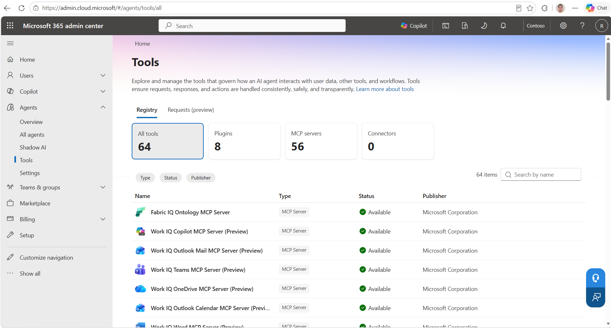
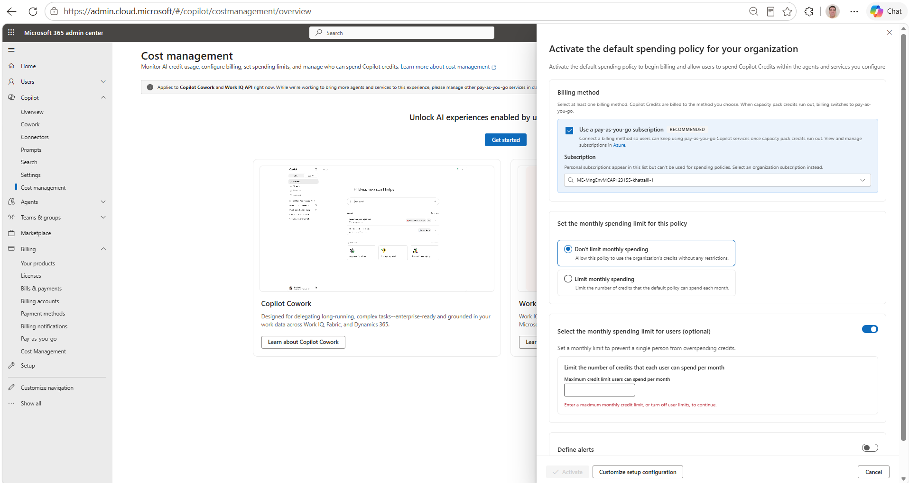
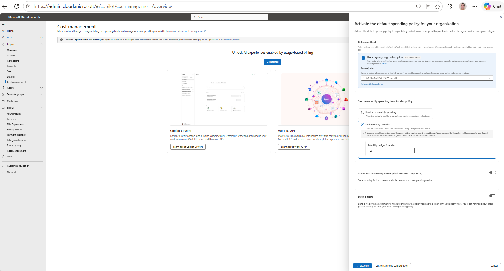
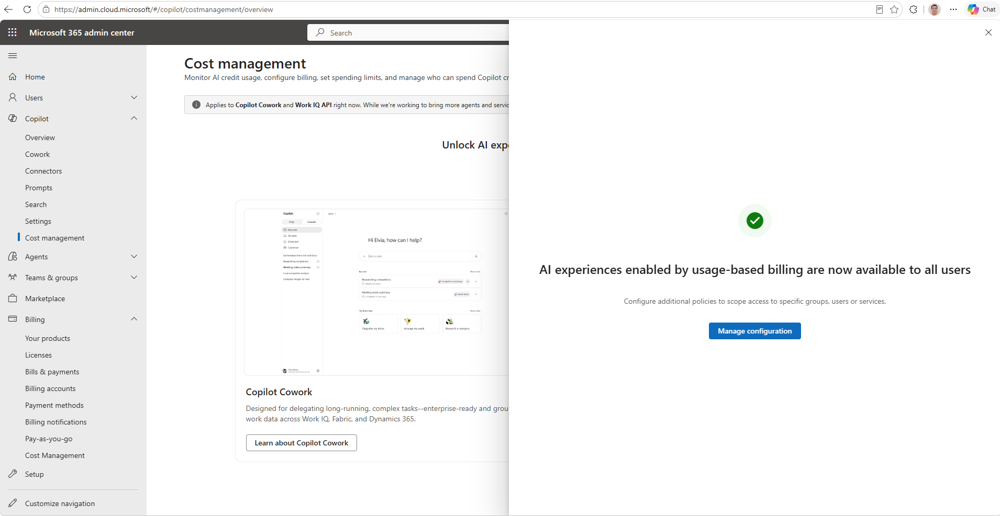

# Runbook: connect a third-party Linux agent to Work IQ MCP

Follow the steps in sequence and complete the validation check for each stage before proceeding. If a check fails, use the corresponding entry in [03-troubleshooting.md](03-troubleshooting.md), which is indexed by error message.

Prerequisite: everything in [01-prerequisites.md](01-prerequisites.md) is done.

---

## Step 0: Clone the repositories

```bash
git clone https://github.com/renatocamara/workiq-mcp-third-party-runbook
git clone https://github.com/microsoft/work-iq
```

## Step 1: Tenant enablement (one time, Global Administrator, PowerShell)

Work IQ requires tenant-level provisioning and administrative consent. Use the current Microsoft-provided tenant enablement procedure for the Work IQ version being validated. During the validation documented in this repository, the Microsoft Work IQ enablement script provisioned the Work IQ and MCP-related service principals and granted the required consent in one pass. Run from PowerShell 7 (Windows, or `pwsh` on Linux):

```powershell
cd work-iq
Install-Module Microsoft.Graph -Scope CurrentUser
./scripts/Enable-WorkIQToolsForTenant.ps1
```

Sign in as a Global Administrator of the target tenant when prompted.

**Expected output:** creation (or "already exists") of the Work IQ and MCP-server service principals (during our validation: `Work IQ Tools`, `mcp_MailTools`, `mcp_MeServer`, `mcp_CalendarTools`, `mcp_TeamsServer`, `mcp_OneDriveRemoteServer`, `mcp_SharePointRemoteServer`, `mcp_AdminTools`, `mcp_WordServer`, `mcp_M365Copilot`), followed by "Granted:" consent lines, ending with `Work IQ tenant enablement complete!`

**Validation check:** in the Microsoft 365 admin center, **Agents > Tools** lists the Work IQ MCP servers as Available:



> Validate tenant enablement even if a Work IQ service principal is already present. A partially configured tenant can produce authorization or entitlement failures that resemble billing issues.

## Step 2: Register the client app (one time, bash from Linux)

Your agent needs its own Microsoft Entra identity to request Work IQ tokens. The provided script is idempotent and safe to re-run:

```bash
cd workiq-mcp-third-party-runbook/scripts
az login --use-device-code       # sign in as an admin of the target tenant
./setup-workiq-app.sh
```

What it does: ensures the Work IQ resource service principal exists, creates a **public client** app registration (required for device code flow), adds the delegated `WorkIQAgent.Ask` permission (resolving the scope ID dynamically), and grants tenant-wide admin consent, with retries for Microsoft Entra replication delays.

> **Why is there no client secret or certificate?** The app is deliberately registered as a **public client** (`--is-fallback-public-client true`), and public clients do not use application credentials by design. Microsoft Entra distinguishes application types by one question: can the app keep a secret? Server-side **confidential clients** can, so they authenticate as an application with a certificate or secret. **Public clients** (CLIs, desktop apps) run on user machines where any embedded secret would be extractable, so the application does not authenticate at all; only the user does, interactively, with MFA and Conditional Access enforced by the tenant. The resulting token is delegated and permission-trimmed to that user. This is not weaker security; it is the correct model for this scenario. Note the production contrast: a server-side agent platform would typically be the opposite case, a **confidential client** using Authorization Code with PKCE or an on-behalf-of flow, with a certificate (preferred) or a vault-stored secret. See [Production auth considerations](../README.md#production-auth-considerations), and the official references: [Public client and confidential client applications](https://learn.microsoft.com/en-us/entra/identity-platform/msal-client-applications) and the [OAuth 2.0 device authorization grant](https://learn.microsoft.com/en-us/entra/identity-platform/v2-oauth2-device-code).

**Expected output:** ends with two `export` lines for `TENANT_ID` and `CLIENT_ID`.

**Validation check:** the script prints `Setup complete`. Keep the two export values.

## Step 3: First MCP contact (no billing needed yet)

```bash
export TENANT_ID="<from step 2>"
export CLIENT_ID="<from step 2>"
./workiq-mcp.sh tools
```

Complete the device-code sign-in as the test user (provisioned for the Microsoft 365 workloads under test).

**Expected output:** the server identifies itself (`WorkIQ.MCP.Server`) and lists the available tools. During the August 2026 validation the server returned 11 tools (`ask`, `fetch`, `fetch_blob`, `list_agents`, `get_schema`, `search_paths`, `call_function`, `create_entity`, `update_entity`, `delete_entity`, `do_action`); the tool surface can evolve, so validate successful tool discovery rather than an exact count.

**Validation check:** tool list renders. Auth, handshake, and discovery are working. Note: data calls (`fetch`, `ask`) will still fail until Step 4; that is expected.

## Step 4: Configure usage-based billing (one time, portal)

Custom and third-party agents that use Work IQ APIs are subject to usage-based billing through Copilot Credits. Microsoft 365 Copilot licensing does not replace this consumption requirement for third-party Work IQ API usage. Until a spending policy is active, data calls fail with an entitlement error.

> **Billing method options.** This runbook validates the **pay-as-you-go** method, which requires an Azure subscription (and Contributor RBAC on it, since setup creates a resource group). It is not the only option: **Copilot Credit capacity packs** are prepaid bundles (USD 200 per tenant per month for 25,000 credits at time of writing) purchased directly in the Microsoft 365 admin center as a tenant-wide resource, with no per-user licenses. When both exist, prepaid credits are consumed first and pay-as-you-go applies only to overage; monthly pack credits do not roll over. For large or multi-workload commitments there is also the annual **Pre-Purchase Plan (P3)**. Capacity packs appear as an additional choice in the spending policy's Billing method step when the tenant owns them. This runbook did not validate the capacity-pack path end to end; evaluate it with the official docs: [Prepaid capacity packs vs pay-as-you-go](https://learn.microsoft.com/en-us/microsoft-365/copilot/pay-as-you-go/copilot-capacity-packs).

1. Open the **Microsoft 365 admin center** (admin.cloud.microsoft) as a **Global Administrator or Billing Administrator** (the roles that can set or change the billing method).
2. Go to **Copilot > Cost management**. The page states it applies to Copilot Cowork and **Work IQ API**.
3. Click **Get started**. The default spending policy panel opens:

   

4. Fill the panel top to bottom:
   - **Billing method:** keep "Use a pay-as-you-go subscription" checked.
   - **Subscription:** click the dropdown and **select the subscription from the list**. Typing alone does not commit the selection, and the Activate button stays disabled (see [Troubleshooting #7](03-troubleshooting.md#7-activate-button-stays-disabled-in-the-spending-policy-panel)).
   - **Monthly spending limit:** choose "Limit monthly spending" and set a conservative credit budget for the pilot.
   - **Per-user limit:** set a value or switch the toggle off; leaving it on with an empty field blocks activation.
5. When the panel looks like this, click **Activate**:

   

**Expected outcome:** a success screen: "AI experiences enabled by usage-based billing are now available to all users".



**If activation fails with a resource-group authorization error**, the admin lacks Azure RBAC on the chosen subscription. That exact error and its fix (including the Global Administrator elevation path) are documented in [Troubleshooting #6](03-troubleshooting.md#6-couldnt-activate-copilot-credits-azure-rbac-error).

**Validation check:** success screen shown. Allow a few minutes for the policy to propagate.

## Step 5: End-to-end data validation

Fresh token first (the cache is not tenant-aware), then the three probes:

```bash
rm -f ~/.workiq_token
./workiq-mcp.sh fetch "/me/messages"
./workiq-mcp.sh fetch "/me/events"
./workiq-mcp.sh ask "Do I have any meetings today?"
```

**Expected outputs:**

- `fetch` returns `"statusCode": 200` with `"isError": false`. An empty `value: []` with 200 still counts as success for a user with an empty mailbox; the entitlement and data path are working. Populate the mailbox (send the user an email from another account) and re-run to see real data flow.
- `ask` returns a natural-language answer. For newly created users/content, `ask` may report 0 results while `fetch` shows the data. During validation this was consistent with asynchronous indexing: newly created content appeared in `fetch` before it became discoverable through `ask`, and indexing latency can vary. If this happens, wait for indexing to complete and re-test `ask` later.

**Validation check:** all three commands return without the entitlement error. The integration path is validated. Compare your outputs against the captured known-good runs in [04-validation-evidence.md](04-validation-evidence.md).

## Step 6: Validation success criteria

| Layer | Evidence |
|---|---|
| Authentication (delegated, custom app) | Device code flow completes, token issued |
| MCP connectivity | Server banner + tool discovery |
| Tenant provisioning | Work IQ MCP servers listed in the admin center tools registry |
| Work IQ access/billing entitlement | `fetch` returns 200 instead of the entitlement error |
| Microsoft 365 data retrieval | Real message/event objects in `fetch` output |
| Work IQ reasoning | `ask` answers over indexed content |

## Step 7: Cleanup (borrowed or test tenants)

Undo everything this runbook created, in reverse order:

```bash
# Remove the client app registration
az ad app delete --id "$CLIENT_ID"

# Remove the Azure RBAC assignment if you added one for billing setup
az role assignment delete --assignee "<upn>" --role "Contributor" \
  --scope "/subscriptions/<sub-id>"
```

- Deactivate or adjust the spending policy in Copilot > Cost management if the tenant should stop accruing charges.
- If you used the Global Administrator **"Access management for Azure resources"** elevation, switch it back to **No** in Microsoft Entra ID > Properties.
- The Work IQ service principals provisioned in Step 1 generally do not need to be removed as part of validation cleanup; retain or remove them according to the organization's tenant governance requirements.
