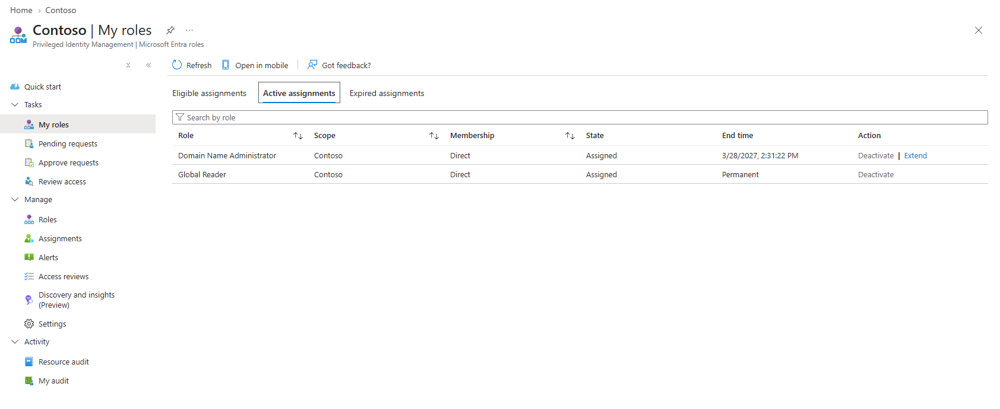
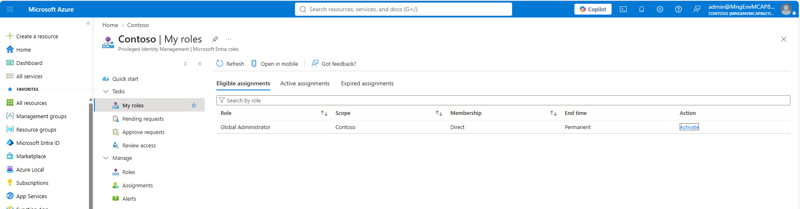
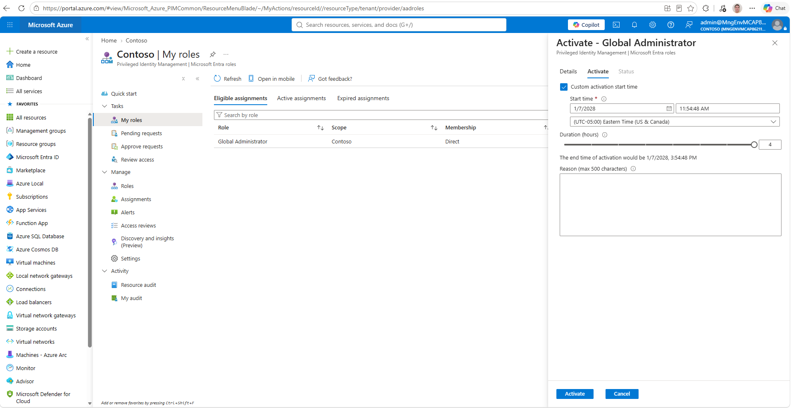
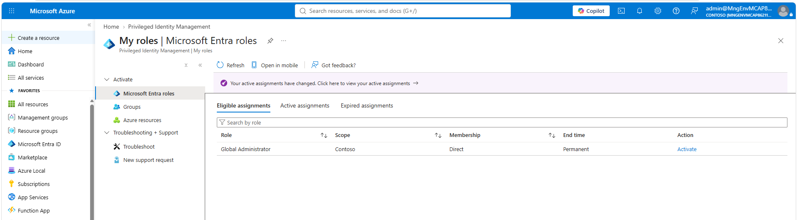
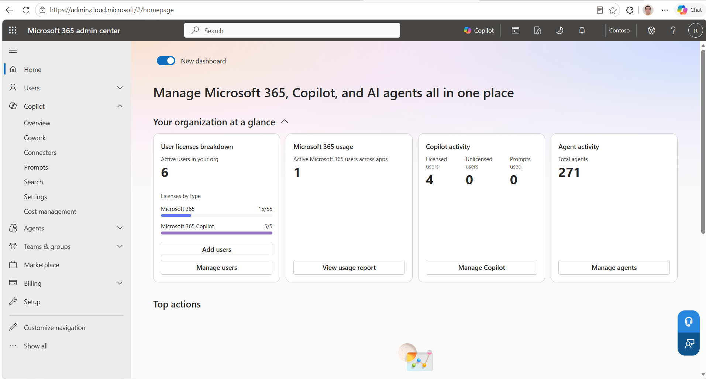
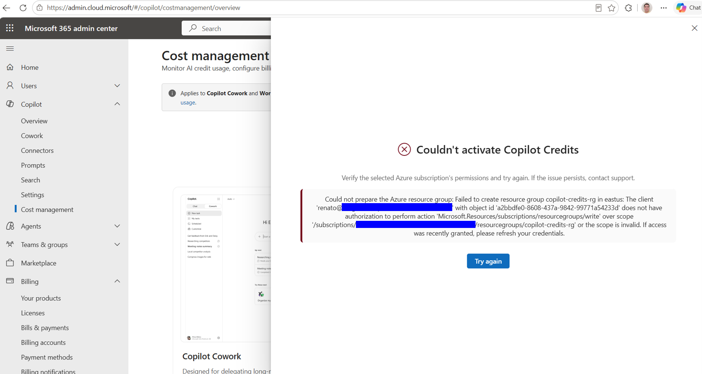
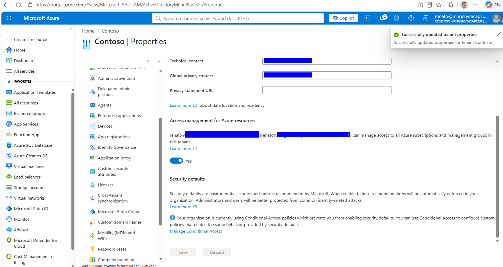

# Troubleshooting: every error we hit, with fixes

All of these occurred during real validation across three tenants. They are ordered roughly as you will encounter them. Search this page for your exact error text.

---

## 1. `az login` cannot open a browser (WSL)

**Symptom:**
```
/usr/bin/xdg-open: 882: x-www-browser: not found
... (long list of browsers not found)
```

**Cause:** WSL has no browser. The login often still completes through the Windows browser via WAM, but device code is deterministic.

**Fix:** always use `az login --use-device-code` in WSL. For Node-based tools that insist on opening a browser (like the official `workiq` CLI), install the bridge: `sudo apt install -y wslu && export BROWSER=wslview`.

---

## 2. `Insufficient privileges to complete the operation` when creating service principals or app registrations

**Symptom:** `az ad sp create` / `az ad app create` fails immediately.

**Cause:** the signed-in user lacks an **Entra directory role**. Two traps, both field-hit:

1. **Azure subscription Owner is not an Entra role.** RBAC governs Azure resources; app registrations and service principals are directory operations requiring Global Administrator, Application Administrator, or Cloud Application Administrator.
2. **PIM-eligible roles are not active roles.** If Global Admin is assigned as *eligible*, you hold Reader-level access until you activate it.

**Diagnosis:** check ACTIVE roles (this is what your token carries):
```bash
az rest --method get \
  --url "https://graph.microsoft.com/v1.0/me/memberOf/microsoft.graph.directoryRole?\$select=displayName" \
  | jq -r '.value[].displayName'
```
If you see only `Global Reader` or similar, but expect Global Admin, your role is PIM-eligible and not activated:



**Fix:** Entra portal > Privileged Identity Management > My roles > Microsoft Entra roles > **Eligible assignments** > Activate:



On the activation panel, **uncheck "Custom activation start time"** if it defaults to a future date (ours defaulted to a date more than a year out, which silently schedules the activation instead of applying it), enter a justification, Activate:





**Critical final step:** `az logout && az login --use-device-code`. Tokens issued before activation do not carry the role.

---

## 3. `PermissionScopeNotGranted ... RoleEligibilitySchedule.Read.Directory` when querying PIM via `az rest`

**Symptom:** Graph returns Forbidden with missing `RoleManagement.*` scopes.

**Cause:** the Azure CLI's first-party Graph token does not include PIM role-management scopes, and you cannot easily add them.

**Fix:** do not fight it. Inspect and activate PIM roles in the portal (see #2). CLI is the wrong tool for this one task.

---

## 4. Entitlement error in a tenant without M365: `The caller is not entitled to use this tool. Please check your billing policy and AI credit entitlement.`

**Symptom:** MCP handshake and `tools/list` succeed, but every `fetch`/`ask` returns the entitlement error.

**Cause (variant A):** the tenant has no Microsoft 365 at all. We hit this twice: one tenant had only `AAD_PREMIUM_P2`, another was Entra ID Free. No mailbox, no Copilot license, nothing to bill or query. No configuration fixes this; it is the wrong tenant.

**Diagnosis:**
```bash
az rest --method get --url "https://graph.microsoft.com/v1.0/subscribedSkus?\$select=skuPartNumber,prepaidUnits,consumedUnits" \
  | jq -r '.value[] | "\(.skuPartNumber)\tavailable:\(.prepaidUnits.enabled - .consumedUnits)"'
```

**Fix:** pick a tenant with M365 E3/E5 + Copilot SKUs (see [Prerequisites](01-prerequisites.md)). Confirm the test user's own licenses too:
```bash
az rest --method get --url "https://graph.microsoft.com/v1.0/me/licenseDetails" | jq -r '.value[].skuPartNumber'
```
A healthy result looks like `Microsoft_365_Copilot` + an E5 SKU:



---

## 5. Entitlement error persists WITH Copilot license (billing gate)

**Symptom:** same error text as #4, but `me/licenseDetails` shows `Microsoft_365_Copilot`, and the official first-party `workiq` CLI works for the same user.

**Cause:** two stacked requirements beyond the license:

1. **Incomplete tenant enablement.** The universal Work IQ SP alone is not enough; the ten MCP-server SPs and their consents must exist. Fix: run `Enable-WorkIQToolsForTenant.ps1` from [microsoft/work-iq](https://github.com/microsoft/work-iq) as Global Admin (Runbook Step 1).
2. **No usage-based billing policy.** A Copilot license entitles first-party clients; **custom/third-party agents are billed by consumption** and require an active pay-as-you-go spending policy. This is the key commercial finding of the whole validation. Fix: Runbook Step 4 (Copilot > Cost management > Get started).

The definitive isolation test: if `workiq ask` (first-party CLI) answers but your own app gets the entitlement error, the gap is billing policy, not license or enablement.

**Caution when comparing with the CLI:** browser SSO can silently sign the CLI into your corporate account instead of the test user, making the CLI "work" against the wrong tenant. Always pass `--account <test-upn>` and sanity-check whose calendar/mail the answers describe.

---

## 6. `Couldn't activate Copilot Credits` (Azure RBAC error)

**Symptom:** the spending-policy Activate fails with:
```
Could not prepare the Azure resource group: Failed to create resource group copilot-credits-rg ...
does not have authorization to perform action 'Microsoft.Resources/subscriptions/resourcegroups/write'
```



**Cause:** the mirror image of #2. The admin has the Entra role (Global Admin) but **no Azure RBAC on the chosen subscription**. Billing setup creates a resource group, which is an ARM operation.

**Fix option A (preferred):** have a subscription Owner grant you Contributor:
```bash
az role assignment create --assignee "<your-upn>" --role "Contributor" \
  --scope "/subscriptions/<sub-id>"
```

**Fix option B (self-service if you are Global Admin):** use the elevation toggle, then self-assign:
1. Entra ID > **Properties** > "Access management for Azure resources" > **Yes** > Save:

   
2. Refresh the CLI token and assign the role:
```bash
az logout && az login --use-device-code --tenant <tenant-id>
az role assignment create --assignee "<your-upn>" --role "Contributor" \
  --scope "/subscriptions/<sub-id>"
```
3. Retry Activate in the admin center. RBAC can take a minute or two to propagate; retry once before digging deeper.
4. **Cleanup:** switch the elevation toggle back to No when done. It grants tenant-wide User Access Administrator and should not stay on.

---

## 7. Activate button stays disabled in the spending-policy panel

**Symptom:** all fields look filled but Activate is greyed out.

**Causes and fixes, in the order we hit them:**

1. **Per-user limit toggle on with empty field.** The red validation text "Enter a maximum monthly credit limit, or turn off user limits" is easy to miss. Enter a value or switch the toggle off.
2. **Subscription not actually selected.** The dropdown shows typed/suggested text without committing it. Click the dropdown and select the subscription **from the list**; the Activate button lights up immediately when the selection registers.

---

## 8. npm `EALLOWREMOTE: Fetching packages of type "remote" have been disabled`

**Symptom:** `npx -y @microsoft/workiq` fails on a corporate Windows machine.

**Cause:** enterprise npm policy (1ES) blocks remote tarball fetches on the Windows side.

**Fix:** run npm/npx inside WSL, where the default public registry applies. Combine with the browser bridge from #1 for sign-in.

---

## 9. `workiq` CLI: `'-t' was not matched`

**Symptom:** older docs/blogs show `workiq ask -t <tenant-id>`; current versions reject `-t`.

**Fix:** the current selector is `--account <upn>` (uses/creates the cached account). Run `workiq ask -h` for the live option list; the tool is in preview and flags change.

---

## 10. Empty results that look like failures (but are not)

Three distinct cases, all encountered:

1. **`fetch` returns 200 with `value: []`.** The data path works; the mailbox/calendar is genuinely empty. Populate it and re-run. Note that a "send to self" email may not arrive; sending from a different mailbox is more reliable.
2. **`ask` finds nothing while `fetch` shows the data.** The Copilot semantic index lags raw entity access by hours (sometimes a day) for new users and new content. Expected in preview; re-test `ask` later. `fetch` is the deterministic check.
3. **First-party CLI shows data your `fetch` does not (or vice versa).** Check which account each client actually used; browser SSO loves to pick your corporate identity (see #5, caution note).

---

## 11. Stale token after switching tenants

**Symptom:** you switched target tenants but keep getting results (or errors) from the previous one.

**Cause:** `workiq-mcp.sh` caches its token in `~/.workiq_token` and the cache is **not tenant-aware**. A still-valid token from the previous tenant gets reused silently.

**Fix:** `rm -f ~/.workiq_token` whenever you change `TENANT_ID`/`CLIENT_ID`. To verify which identity a cached token carries:
```bash
jq -r '.access_token' ~/.workiq_token | cut -d. -f2 | tr '_-' '/+' \
  | awk '{l=length($0)%4; if(l==2) $0=$0"=="; else if(l==3) $0=$0"="; print}' \
  | base64 -d | jq '{tid, upn, oid}'
```

---

## Quick decision tree for the entitlement error

```
"The caller is not entitled to use this tool..."
│
├─ Tenant has no M365/Copilot SKUs?            -> wrong tenant (#4)
├─ User missing Copilot license?               -> assign license (#4)
├─ Enable-WorkIQToolsForTenant.ps1 never run?  -> run it (#5.1)
├─ No pay-as-you-go spending policy active?    -> activate billing (#5.2, Runbook Step 4)
└─ Policy activated minutes ago?               -> wait 5 min, refresh token, retry
```
